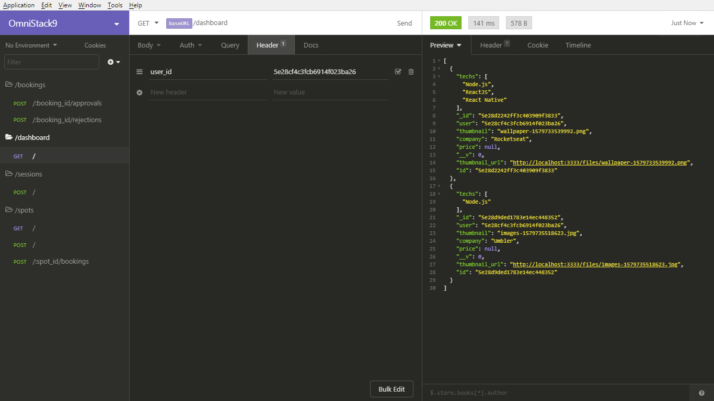
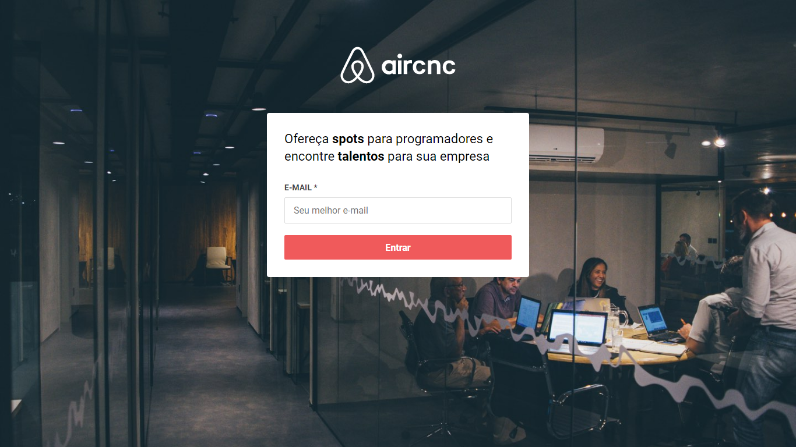
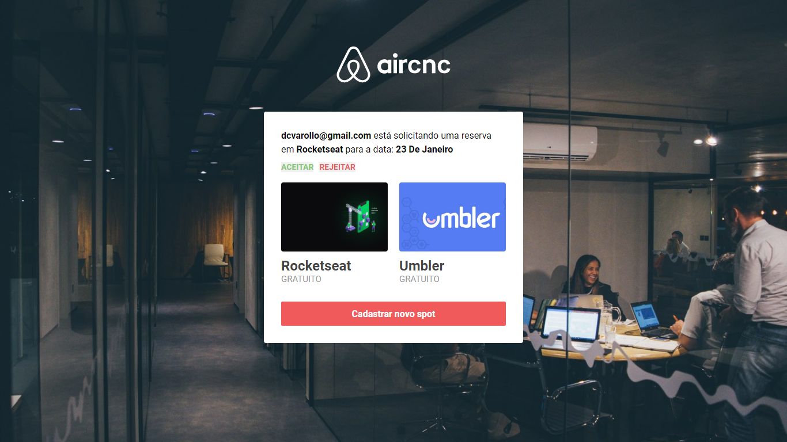
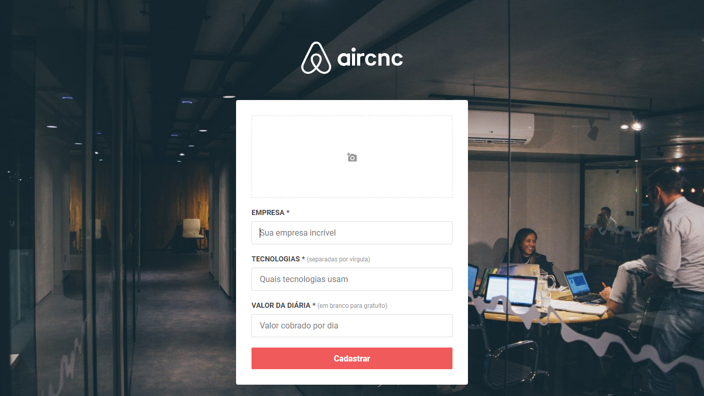
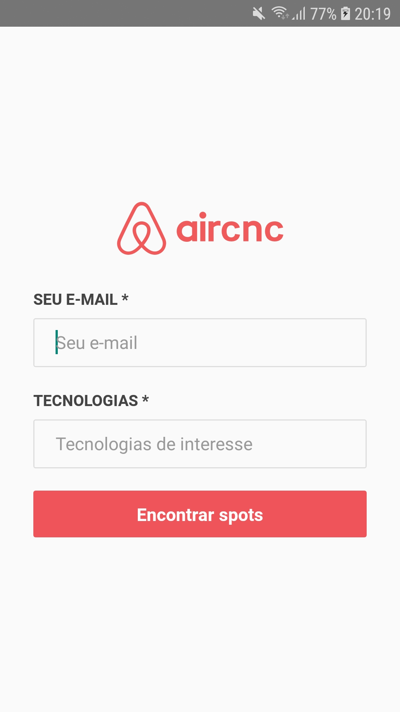
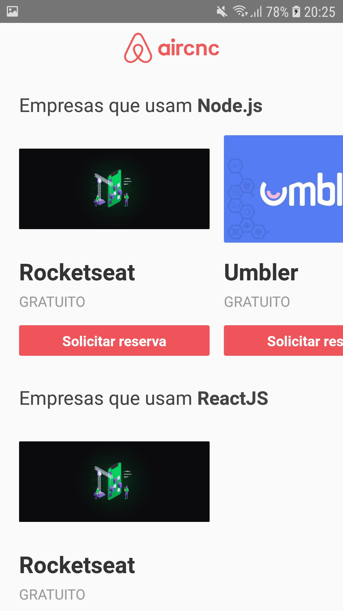
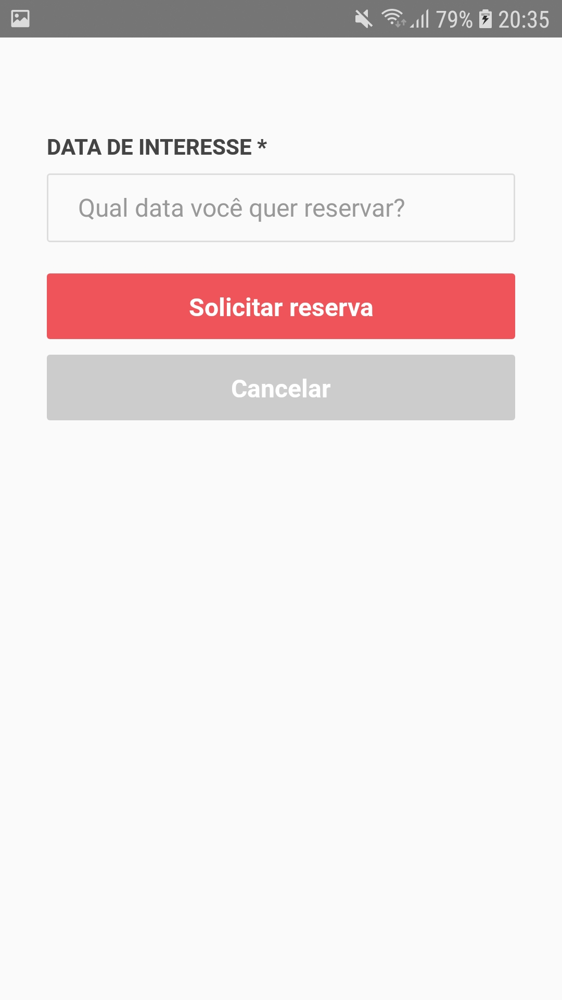

<h1 align="center">Semana Omnistack 9</h1>

Projeto desenvolvido na semana OmniStack 9.0 da Rocketseat.

## Sobre o projeto

A ideia do projeto é construir um "Airbnb" para desenvolvedores.

## Funcionalidades

- Criação de spots
- Listagem dos spots
- Reservar um spot
- Aprovar/Reprovar uma reserva de um spot

## Backend

Para executar o backend siga as instruções do arquivo [README.md](https://github.com/DouglasVarollo/OmniStack9/blob/master/backend/README.md) que está na pasta backend.

  

## Frontend

Para executar o frontend siga as instruções do arquivo [README.md](https://github.com/DouglasVarollo/OmniStack9/blob/master/frontend/README.md) que está na pasta frontend.

  
  
  

## Mobile

Para executar o mobile siga as instruções do arquivo [README.md](https://github.com/DouglasVarollo/OmniStack9/blob/master/mobile/README.md) que está na pasta mobile.

  
  
  

